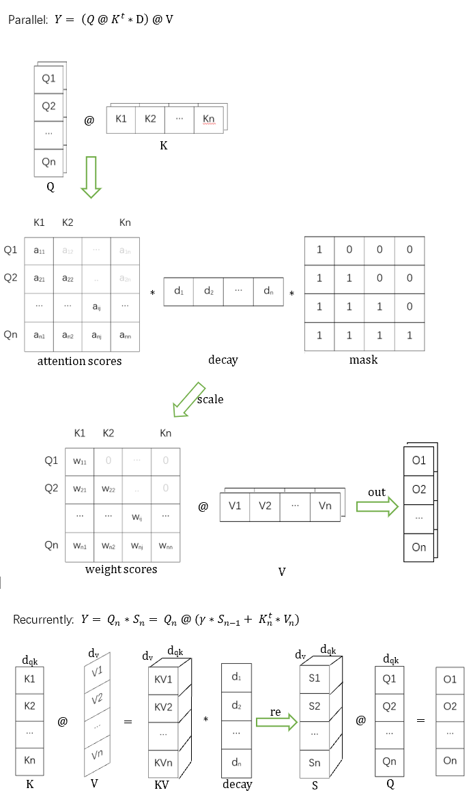

# RetNet

Maybe the simplest RetNet implementation, merged parallel, recurrent and trunkwise code all. This repo is just for learning and backup. I haven't do any testing on CUDA device yet. So, the code can only run on CPU for now.

The intresting thing is: MSR block implementation < 100 lines code. :)

Please ignore all aka code here. It's a sample proxy to torch:

    aka.nn --> torch.nn
    aka.numpy --> torch + torch.nn.functional
    aka.repo --> transformer

## Requirements

    python
    torch
    torchvision
    transformer

## Prepare

Download data files from: https://hf-mirror.com/isek-ai/SDPrompt-RetNet-300M

to folder:

    data/SDPrompt-RetNet-300M

## Run

python Retention.py

## Graphs

